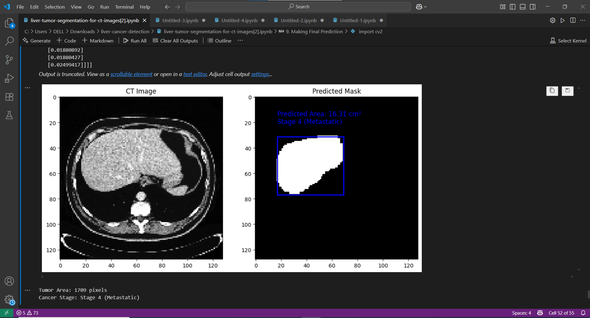

# Liver Cancer Detection using CNN

## 🔍 Overview
This project uses a Convolutional Neural Network (CNN) to detect liver cancer from medical imaging data. It demonstrates how deep learning can be used for medical image classification.

Developed using Google Colab and trained on medical CT scan images.

## 🧠 Tools & Technologies
- Python
- TensorFlow / Keras
- CNN (Convolutional Neural Networks)
- Google Colab

## 📁 Files
- `liver_cancer_model.ipynb`: The notebook containing the full training process
- `README.md`: Project documentation

## 🚀 Results
Model achieved **[ 98 %]** accuracy on validation data.

## 🔄 Future Work
- Use transfer learning with ResNet50 or VGG16
- Improve dataset preprocessing
- Deploy using Streamlit or Flask

## 👨‍💻 Author
[Ramy Tarek Rezk](https://github.com/ramyrezk22)

## 📸 Sample Result

